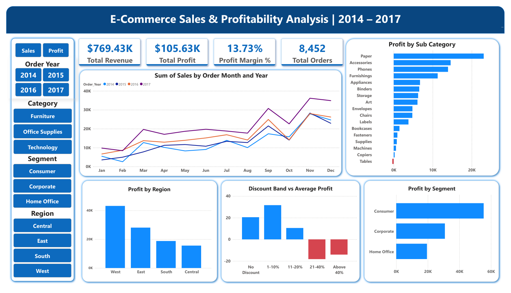
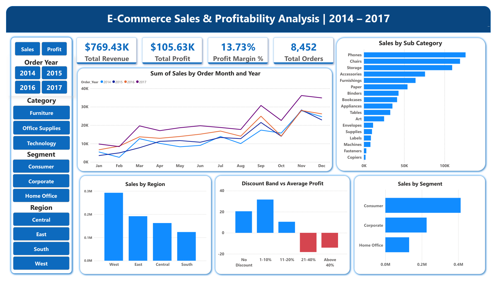

# E-Commerce Sales & Profitability Analysis
### MySQL → Python → Power BI &nbsp;|&nbsp; 9,994 Orders &nbsp;|&nbsp; $769K Revenue &nbsp;|&nbsp; 2014–2017



---

## Business Problem

RetailCo Analytics operates a US-based e-commerce business generating **$769,431 in revenue** across 8,452 orders — but profit margin is only **13.73%**, well below the 20–25% industry benchmark for e-commerce retail.

Revenue grew 30.2% in 2017 alone. Yet overall margin stayed flat. That means the business is scaling volume but not profitability — a clear signal that something in the pricing or discount structure is wrong.

This project investigates where profit is being lost, which discounting decisions are destroying margin, and which regions, categories, and customer segments are driving or dragging performance. Every finding is tied to a dollar figure and a specific recommendation.

---

## Dashboard

Two views in one dashboard, toggled via Power BI bookmarks — no separate pages.

| Profit View | Sales View |
|---|---|
|  |  |

**KPI Cards:** &nbsp; `$769.43K Total Revenue` &nbsp;·&nbsp; `$105.63K Total Profit` &nbsp;·&nbsp; `13.73% Profit Margin` &nbsp;·&nbsp; `8,452 Total Orders`

**Slicers:** Order Year (2014–2017) &nbsp;·&nbsp; Category &nbsp;·&nbsp; Customer Segment &nbsp;·&nbsp; Region

---

## Key Findings & Recommendations

### 1 — Discount Policy is Destroying $14,830 in Profit Annually

977 orders — 1 in every 9 — carried discounts above 20%. Together they generated $68,906 in revenue but produced **negative $14,830 in profit**. The correlation between discount and profit margin is **−0.86**, near-perfect. This is not an opinion — it is a mathematical relationship in the data.

Orders with no discount average $20.49 profit. The 1–10% band actually earns more at $31.63 — modest discounts help close deals without hurting margin. Cross 20% and profit flips negative.

> **Recommendation:** Cap discounts at 20% company-wide. No structural change required — this is a policy decision. Immediate recovery of $14,830 in annual profit, which represents 14% of total profit the business is currently leaving on the table.

---

### 2 — Furniture is a Revenue Trap, Not a Profit Driver

Furniture generates $257,191 in revenue — the second highest category. But its profit margin is only **6.68%**, less than half the business average of 13.73%.

Inside Furniture, Tables is the only loss-making sub-category in the entire dataset at **−$358 profit** on $32,715 in sales. Furnishings quietly earns $11,274. Chairs earns $4,780 but 69.9% of Chair sales are concentrated in Q3–Q4, making it a highly seasonal sub-category that requires specific planning.

> **Recommendation:** Tables needs a discount audit immediately — the data strongly suggests it is being over-discounted. Chairs needs a September inventory and marketing plan, not a year-round one. Furniture cannot be managed as a single category — the sub-categories have completely different performance profiles and need different commercial strategies.

---

### 3 — Central Region Has a Margin Problem, Not a Volume Problem

| Region | Revenue | Profit | Margin |
|--------|---------|--------|--------|
| West | $292,419 | $43,187 | 14.77% |
| East | $191,521 | $28,084 | 14.67% |
| South | $123,388 | $18,775 | **15.22%** |
| Central | $162,097 | $15,587 | **9.62%** |

South generates the lowest revenue but the highest margin — disciplined pricing. Central generates more revenue than South but earns $3,187 less in profit. The problem is not volume. The 4.1 percentage point margin gap between Central and the business average represents approximately **$6,600 in recoverable profit annually** at current revenue levels.

> **Recommendation:** Audit Central region's discount behaviour before investing further in growing its volume. The hypothesis the data supports is that Central is discounting more aggressively to close deals. Fix the discount discipline first. Growing a low-margin region's volume without fixing margin only scales the loss.

---

### 4 — Q4 is Predictable and Consistently Underexploited

Q4 is the peak quarter in every single year from 2014 to 2017 without exception. November is the peak month every year. Q4 2017 revenue was $93,596 — 2.5x the Q1 figure of $37,805.

September to December accounts for **44.4% of annual revenue**. The Consumer segment drives this peak — verified from the data:

- Consumers account for **57.5% of Chairs** sales in Sep–Dec
- **54.1% of Storage** in Sep–Dec
- **54.1% of Accessories** in Sep–Dec
- **52.7% of Phones** in Sep–Dec

> **Recommendation:** Inventory and marketing planning for peak season must be complete by August. Promotions launched in October miss the September spike entirely. The four sub-categories to prioritise — Phones, Chairs, Storage, Accessories — and the segment to target — Consumer — are both confirmed by data, not assumption.

---

### 5 — Office Supplies is the Silent Profit Engine

Office Supplies generates **$59,089 in profit at 19.69% margin** — the highest margin of any category and nearly 3x Furniture's 6.68%. Paper alone earns **$23,067 in profit** from $54,097 in sales — a 42.6% margin. Accessories generates $14,591 profit at healthy margin.

These are high-margin, consistent-volume products. They do not have seasonal concentration. They generate repeat purchases.

> **Recommendation:** Marketing and promotional investment in Office Supplies consumables has better ROI than equivalent investment in Furniture. If the business runs promotions — not discounts, promotions — Paper and Accessories should be the priority because they drive repeat behaviour at the margins that actually sustain the business.

---

### 6 — Revenue Growth is Real. Margin Growth is Not.

| Year | Revenue | Growth | Profit Margin |
|------|---------|--------|---------------|
| 2014 | $157,693 | — | 13.1% |
| 2015 | $162,630 | +3.1% | 14.7% |
| 2016 | $195,075 | +20.0% | 14.1% |
| 2017 | $254,027 | **+30.2%** | 13.2% |

Revenue grew 61% over four years. Profit margin barely moved. The business is generating more orders but not more efficiently. The most likely explanation — supported by the discount analysis — is that sales volume is being bought with higher discounting. This means the discount problem compounds at scale.

> **Recommendation:** The 30% revenue growth in 2017 is a good headline. But flat margin at higher volume is a warning sign, not a success. The discount cap recommendation is not just about this year's $14,830 — it becomes a $20,000+ annual problem if growth continues at the current discount rate.

---

## Technical Pipeline

```
Raw CSV  →  MySQL 8.0  →  Python / Jupyter  →  Power BI Desktop
```

**MySQL — Schema, Cleaning, Analysis**
- Mixed-format date normalisation: `CASE`-based `STR_TO_DATE()` handling both `MM/DD/YYYY` and `MM-DD-YYYY` formats in a single `UPDATE` — no Python preprocessing required
- Data quality checks: nulls, duplicate Order IDs, negative sales, discount range validation
- 9 business analysis queries across category, region, segment, discount impact, and seasonal trends
- 3 advanced queries: `RANK() OVER (PARTITION BY Category)` for sub-category ranking within category, `LAG()` for year-over-year revenue growth calculation

**Python — EDA and Feature Engineering**
- Outlier treatment using **3× IQR** (not the standard 1.5×) — manually reviewed flagged rows, confirmed they were legitimate bulk corporate orders, not data errors; removing them would have distorted the segment analysis; decision documented in notebook
- Feature engineering: `Discount_Band`, `Month_Name`, `Order_Year`, `Order_Quarter`, `Profit_Margin_Pct`
- 9 charts across business questions with written insight cells below each chart
- Final export: `ecommerce_clean.csv` (27 columns)

**Power BI — Dashboard**
- DAX measures: `Profit Margin %`, `Total Orders`, `Avg Profit Per Order`
- Calculated column: `Discount_Band_Sort` for correct slicer ordering (not alphabetical)
- Custom `Month_Name` sort column (Jan → Dec)
- Bookmark-based Sales ↔ Profit chart toggle using two overlapping visual groups — single page, no navigation required

---

## Repository Structure

```
ecommerce-sales-analysis/
│
├── data/
│   ├── e_commerce_data.csv           # Raw dataset — 9,994 rows, 21 columns
│   └── ecommerce_clean.csv           # Cleaned and engineered — 27 columns
│
├── notebooks/
│   └── ecommerce_analysis.ipynb      # Full EDA notebook with business insights
│
├── sql/
│   └── e_commerce_analysis.sql       # MySQL schema, cleaning, and all queries
│
├── dashboard/
│   ├── ecommerce_dashboard.pbix      # Power BI file
│   ├── dashboard_profit_view.png     # Screenshot — Profit toggle
│   └── dashboard_sales_view.png      # Screenshot — Sales toggle
│
├── ECommerce_Problem_Statement.pdf   # Business problem statement
└── README.md
```

---

## Dataset

| Attribute | Detail |
|-----------|--------|
| Source | Sample Superstore Sales Dataset |
| Raw rows | 9,994 |
| Raw columns | 21 |
| Engineered columns | 6 additional |
| Period | January 2014 – December 2017 |
| Geography | United States — 4 regions, 49 states |
| Categories | Furniture · Office Supplies · Technology |
| Sub-categories | 17 |

---

## Tools & Technologies

| Tool | Purpose |
|------|---------|
| MySQL 8.0 | Schema design, data loading, cleaning, business queries, window functions |
| Python 3 — Pandas, Matplotlib, Seaborn | EDA, feature engineering, outlier treatment, visualisation |
| Jupyter Notebook | Analysis and documentation |
| Power BI Desktop | Interactive dashboard, DAX measures, bookmarks |

---

*Part of a data analytics portfolio targeting Junior Data Analyst and Business Analyst roles.*
*Pipeline: MySQL → Python → Power BI*
